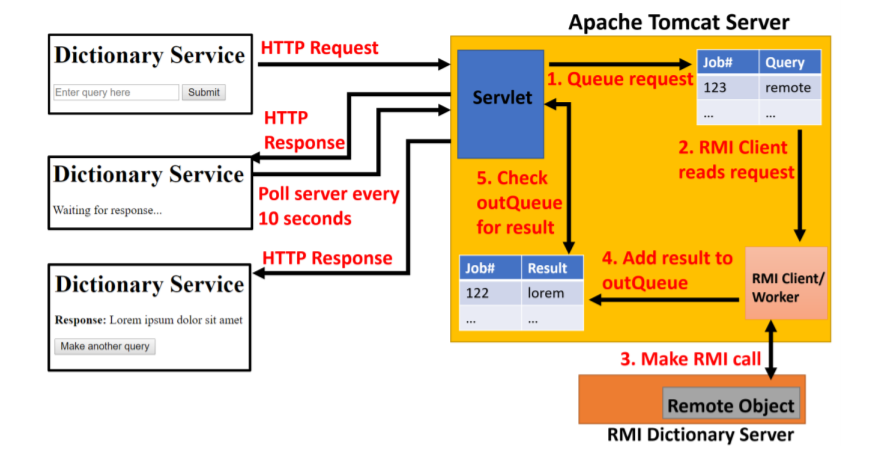
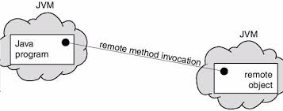

# Asynchronous RMI Dictionary Service
> BSc (hons) in Software Development, Year 4  
> Module: Distributed Systems  
> Lecturer: Dr Patrick Mannion  

## [Contents](#contents)   
* [Introduction](#intro)
* [Project Overview](#overview)  
* [Technologies](#tech)
* [How To Run](#run)           

# Introduction   
My name is [Patrick Moran](https://www.linkedin.com/in/patrick-moran-7a349014b/) and this is my 4th Year Distributed Systems Asynchronous RMI Dictionary Project.

With Distrubuted Computing asyncronous communication is a very important issue. This project takes a hands on approach, programming an asyncronous remote software service. 

[Top](#contents) 
# Project Overview   
In this project we are rewuired to use the JSP/Servlet and Java RMI Frameworks to create a remote, asynchronous dictionary
lookup service. A user enters a string and this is then matched against a dictionary. The HTML form information should be dispatched to a servlet that adds the client request
to an in-queue and then returns a job ID to the web client. The web client should poll the web server periodically
(every 10 seconds) and query if the request has been processed. Client requests in the inQueue should
be periodically removed and processed (every 10 seconds). An overview of the project can be viewed below.

     

[Top](#contents) 

# Technologies   
### JSP
 

JavaServer Pages (JSP) is a technology that helps developers create dynamically generated webpages using HTML, XML or other document types. In order to run a JSP page, a compatible web server is required. For example Apache Tomcat. 

### Apache Tomcat
 

Apache Tomcat is an open source Web Server and Java Servlet container, developed by the Apache Software Foundation. It provides a pure Java Web Server Envoirnment for Java code to run in. Tomcat Server is responsible for implementing the JavaServlet and the Java Server Pages specifications from [Sun Micro Systems](https://www.oracle.com/sun/index.html). More information can be found [here](https://tomcat.apache.org/whoweare.html).

### Java Servlet
 

A Java servlet is a Java program that extends the capabilities of a server. Java servelets most commonly implement applications hosted on web servers. Servlets are often used with the HTTP protocol. Servlets can be generated automatically from JavaServer Pages by the JavaServer Pages compiler. The difference between servlets and JSP is that servlets typically embed HTML inside Java code, while JSPs embed Java code in HTML. 

### RMI
Remote Method Invocation (RMI) is a mechanism that allows an object residing in one JVM to access/invoke an object running on another JVM. 

 

RMI is used to build Distributed Applications, providing Remote Communication between Java programs. It's accessed in the java.rmi package.

[Top](#contents) 
# How To Run
The following are instructions on how to run this application on your own machine:

Some Prerequisites:   
* Java SDK  
 If you don't have Java on your machine you can download it from [here](http://www.oracle.com/technetwork/java/javase/downloads/jdk8-downloads-2133151.html).

* Apache Tomcat Server  
For this project I'm using Apache Tomcat 8.5. You can download it [here](https://tomcat.apache.org/download-80.cgi).

* Eclipse IDE for Java EE Developers
You can download the eclipse IDE [here](https://www.eclipse.org/downloads/packages/eclipse-ide-java-ee-developers/keplersr2).

Step 1: Download or clone this repository.  
Step 2: Open Eclipse and Import the project named Asynchronous RMI Dictionary Service.  
Step 3: Add Tomcat Server To the Project:  
> 3.1 Go to Window > Preferences > Server > Runtime Envoirnment  
> 3.2 Click add and select the version of tomcat you downloaded and click next.    
> 3.4 Browse to where you downloaded Apache Tomcat (Selecting the root directory) Click Finish.  
> 3.5 Then go to Project > Properties > Java Build Path > Libraries > Add Library > Server Runtime > Apache Tomcat and Finish.  

Step 4: Right Click on DictionaryServiceSetup.java and select run as Java Application.  
Step 5: Right Click on the project (Asynchronous RMI Dictionary Service) and select run as > Run On Server > Finish.  
Step 6: The browser in eclipse will open at the following URL: 
> http://localhost:8080/Asynchronous_RMI_Dictionary_Service/  

Step 7: Enter a word to search for a definition.

[Top](#contents) 
